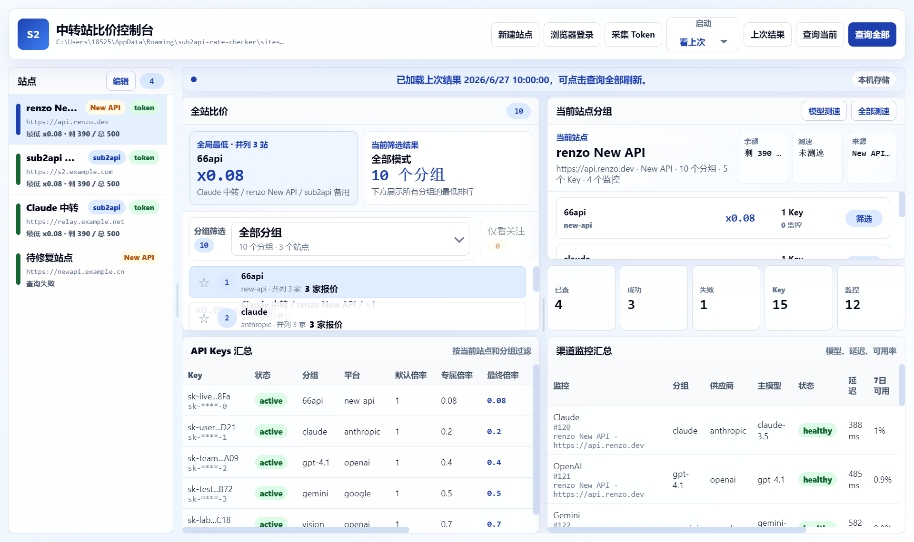
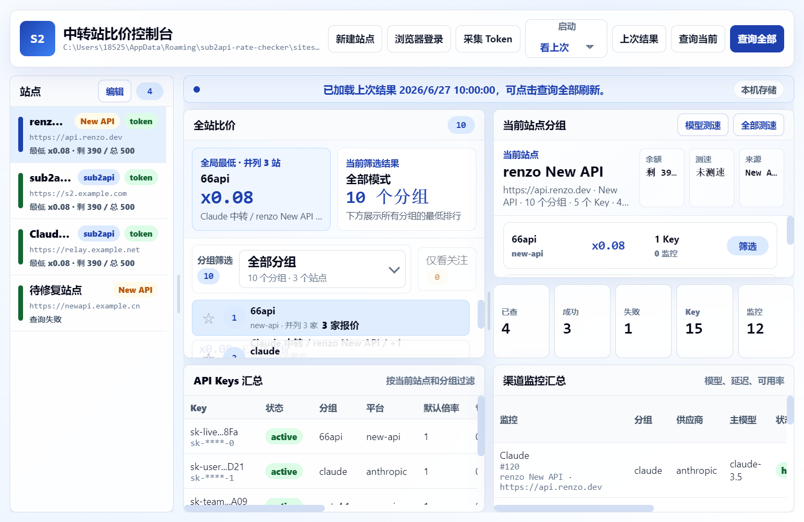

# Sub2API Rate Checker

[](https://github.com/xiaou61/sub2api-rate-checker/actions/workflows/check.yml)


面向中转站用户的桌面端倍率比价控制台。它可以把多个 `sub2api` / `New API` 站点放在同一个界面里，批量查询分组倍率、余额、API Key 分组绑定和渠道监控，并告诉你同一个分组到底哪个站点最便宜。

当前版本：`v0.09`

## 截图





## 适合谁

- 同时维护多个 AI 中转站，想快速比较不同站点的倍率。
- 站点分组很多，需要按 `cc-max`、`claude`、`gpt-4.1` 等分组横向比价。
- 想知道便宜的不只是一个站点，而是所有“并列最低”的站点。
- 想把余额、API Key 分组、渠道监控和真实模型测速放在同一个工作台里看。

## 快速下载

Windows 用户可以直接下载 portable exe，无需安装：

[下载 Sub2API Rate Checker v0.09](https://github.com/xiaou61/sub2api-rate-checker/releases/tag/v0.09)

下载后运行 `Sub2API Rate Checker v0.09.exe` 即可。

## 核心能力

| 能力 | 说明 |
| --- | --- |
| 全站比价 | 按分组聚合所有站点的有效倍率，自动排序出最低价、并列最低、次优倍率和价差。 |
| 站点详情 | 选中某个网站后，右侧展示该站点全部分组、倍率、Key 数、监控数、余额和测速状态。 |
| 分组筛选 | 支持类似 sub2api 的分组下拉搜索，也支持“仅看关注分组”。 |
| 同价处理 | 多个站点价格完全相同时，会展示为“并列最低 · N 个站点”，不会强行只选一个赢家。 |
| 分组别名 | 可以把不同站点的同类分组合并到统一名称，比如把 `Claude Max` 合并到 `cc-max`。 |
| 余额健康 | 兼容多种余额字段，自动判断余额正常、偏低、紧张、未知或不限量。 |
| 真实测速 | 使用真实 API Key 请求 OpenAI 兼容 `/v1/chat/completions`，发送 `hi` 并拿到回复才算测速成功。 |
| 本地快照 | 默认可查看上次查询结果，也可以设置为启动自动刷新或空白进入。 |
| Token 采集 | 支持浏览器登录窗口和本地 Token 采集，也支持手动粘贴 Token。 |

## 支持的站点

### sub2api

已适配的主要接口：

- `POST /api/v1/auth/login`
- `POST /api/v1/auth/refresh`
- `GET /api/v1/admin/groups/all`
- `GET /api/v1/groups/available`
- `GET /api/v1/groups/rates`
- `GET /api/v1/keys`
- `GET /api/v1/channel-monitors`
- `POST /v1/chat/completions`

如果站点存在 Turnstile、2FA 或其他登录保护，推荐使用“浏览器登录 + 采集 Token”，或者手动粘贴网页本地存储里的 `auth_token` / `refresh_token`。

### New API

已适配的主要接口：

- `GET /api/pricing`
- `GET /api/token/`
- `POST /api/token/batch/keys`
- `POST /api/token/{id}/key`
- `GET /api/usage/token/`
- `GET /api/user/self`
- `GET /api/user/self/groups`
- `POST /v1/chat/completions`

部分 New API 站点需要额外请求头 `New-Api-User`，所以站点配置里提供了可选的 `New API User ID`。

## 使用流程

### 1. 添加站点

1. 点击顶部「新建站点」。
2. 填写站点名称和 Base URL，例如 `https://example.com`。
3. 选择站点类型：`sub2api` 或 `New API`。
4. 填写 Token，或点击「浏览器登录」后再点击「采集 Token」。
5. 可选填写「测速模型」。留空时会优先使用渠道监控里的主模型。
6. 点击保存，然后执行「查询当前」或「查询全部」。

### 2. 查看比价

查询完成后，中间的排行榜会按下面规则排序：

```text
最低倍率升序 -> 并列最低站点数降序 -> 分组名升序
```

每个分组会显示：

- 最低倍率。
- 并列最低站点数量。
- 最低站点地址。
- 次优倍率。
- 最低价和次优价的差距。

如果多个站点同价，页面会直接显示“并列最低”，方便你把这些站点都作为候选。

### 3. 筛选常用分组

点击分组前的星标可以把它加入关注。开启「仅看关注」后，排行榜只展示你真正关心的分组，适合长期盯固定模型价格。

### 4. 合并不同站点的分组名

不同站点可能把同一个套餐叫成不同名字。可以在站点配置里的「分组别名」填写：

```text
Claude Max = cc-max
claude-code-max = cc-max
gpt fast => fast
```

左侧是该站点真实返回的分组名，右侧是你希望用于全站比价的标准分组名。保存并重新查询后，排行榜会按标准名合并。

## 余额和测速

### 余额健康

工具会从 API Key 和用户信息里尽量识别余额字段，兼容常见字段名：

```text
remain_quota
remaining
remaining_quota
balance
available
left_quota
quota_left
```

当能同时拿到总额度和剩余额时，会按比例标记：

- 剩余 `<= 5%`：余额紧张。
- 剩余 `<= 20%`：余额偏低。
- 只返回剩余额且数值很低：余额偏低。
- `quota: -1` 或 unlimited 语义：不限量。
- 接口没有返回可识别字段：余额未知。

### 真实模型测速

测速不是普通 ping，也不是只请求 `/v1/models`。工具会使用站点返回的真实 API Key，向 OpenAI 兼容接口发送一次最小聊天请求：

```http
POST /v1/chat/completions
```

消息内容为 `hi`。只有接口正常返回模型回复时才算测速成功，这样更接近日常调用体验。

## 本地数据

站点配置保存在 Electron 的 `userData` 目录。Windows 上通常类似：

```text
C:\Users\<你的用户名>\AppData\Roaming\sub2api-rate-checker\sites.json
```

这个文件可能包含站点 Token、AccessToken 或密码。不要把它发给别人，也不要提交到 GitHub。

查询结果快照也保存在本地，但保存前会剥离 API Key、token、密码等敏感字段。

## 安全说明

- 不会把 Token 上传到第三方服务器。
- 不会在日志里主动打印 Token。
- 真实 API Key 只在主进程内存里临时用于测速。
- 页面、测试 hook 和快照只展示脱敏 Key。
- 当前版本仍会在本机明文保存站点配置，建议只在自己的可信电脑上使用。

## 从源码运行

需要 Node.js 22 或更高版本。

```bash
npm install
npm start
```

运行检查：

```bash
npm test
npm run smoke:ui
node scripts/audit-ui-layout.js
```

## 构建 Windows exe

```bash
npx electron-builder --win portable --publish never --config.directories.output=dist-release-v0.09
```

构建完成后，portable exe 会出现在 `dist-release-v0.09/` 目录。

## 项目结构

```text
src/main.js                    Electron 主进程和 IPC
src/storage.js                 本地站点配置、偏好和快照存储
src/sub2apiClient.js            sub2api / New API 查询客户端
src/preload.js                 Renderer 安全桥接
src/renderer/index.html         页面结构
src/renderer/renderer.js        前端交互、比价聚合、余额汇总和测速状态
src/renderer/styles.css         UI 样式
scripts/check-rate-format.js    倍率格式回归检查
scripts/check-newapi-client.js   New API mock 查询检查
scripts/check-comparison-groups.js 分组比价聚合检查
scripts/check-site-overview.js  站点分组面板和余额聚合检查
scripts/check-storage-cache.js  本地快照和偏好存储检查
scripts/check-speed-test.js     API Key 测速检查
scripts/smoke-ui.js             Electron UI 冒烟检查
scripts/audit-ui-layout.js      布局溢出和窗口尺寸审计
```

## 版本记录

### v0.09

- 新增余额健康提示，顶部汇总和当前站点余额卡会显示余额正常、偏低、紧张、未知或不限量。
- 增强余额字段识别，兼容更多 New API / sub2api 返回结构。
- 保留本地快照和启动模式，打开应用时可选择看上次结果、自动刷新或空白进入。
- 继续优化蓝白简洁 UI，提升比价信息密度和可读性。

### v0.08

- 新增启动模式选择：看上次结果、自动刷新、空白启动。
- 启动模式会保存到本地偏好，不影响关注分组等其他设置。

### v0.07

- 新增查询结果快照存储，默认优先加载上次查询结果。
- 保存快照时会剥离 API Key、token、密码等敏感字段。
- 修复偏好保存问题，并扩展余额字段兼容。

### v0.06

- 重构主界面布局：左侧只保留紧凑站点索引，站点配置改为弹窗。
- 新增当前站点分组面板。
- 测速改为真实 `/v1/chat/completions` 请求。

### v0.05

- 新增站点优先概览。
- 新增 API Key 余额汇总和真实 Key 脱敏展示。
- 新增测速逻辑和布局审计。

### v0.04

- 新增关注分组和「仅看关注」模式。

### v0.03

- 新增站点级分组别名。
- README 增加界面预览和别名示例。

### v0.02

- 比价主视图改为分组价格排行榜。
- 支持同价并列最低、次优倍率和价差展示。

### v0.01

- 初始开源版本。
- 支持 sub2api 和 New API 的基础倍率查询与全站比价。

## Roadmap

- 价格历史曲线和涨跌提醒。
- 按模型维度做跨分组映射。
- 站点健康评分：价格、余额、测速、可用率综合排序。
- 导出 CSV / JSON，方便留档或二次分析。

## License

MIT
